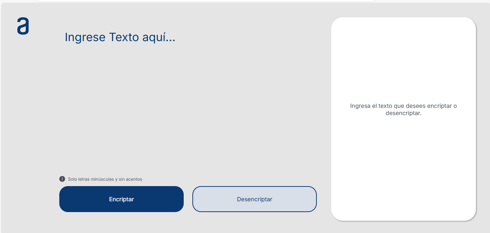
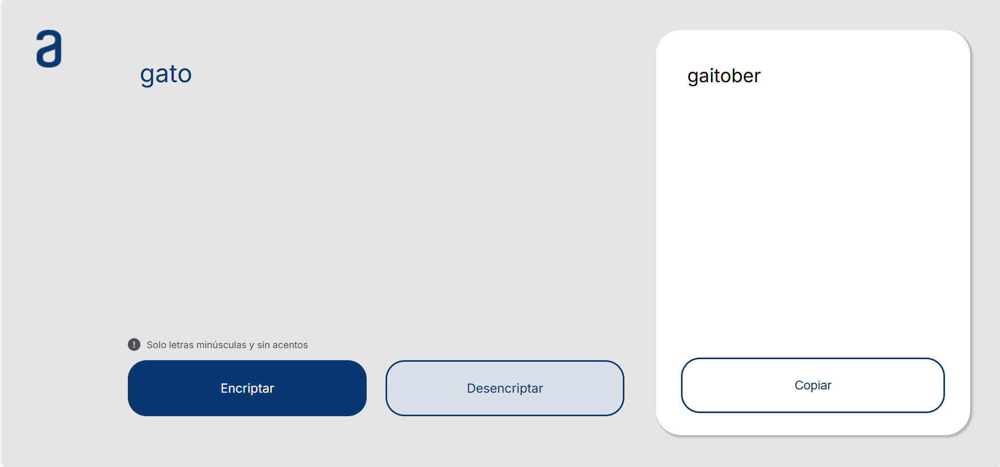
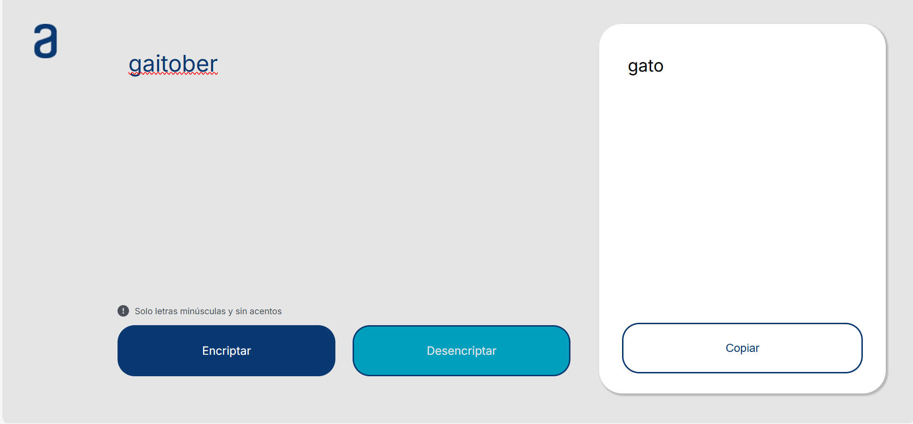
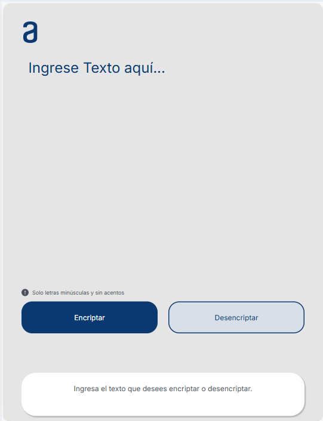

🖥📘📕
# Proyecto Challenge Encriptador de Texto
El siguiente proyecto web fue desarrollado con el objetivo de poder encriptar y desencriptar un mensaje ingresado por el usuario, el funcionamiento de este encriptado funciona con específicas claves de encriptación. 

Para ver imagenes del proyecto puede hacer en 'Interfaz del proyecto'.

* [Interfaz del Usuario](#id2)

## 1. Funcionalidades del proyecto: 
- 🕵🏼🕵🏽‍♀ Encriptar mensajes, textos, párrafos largos, para poder compartirlos en cualquier parte con un solo clic.

- 👩🏻‍💻👨🏻‍💻 Si la otra persona quiere revelar la información mensaje, puedo el mismo enlace para desencriptarlo y descubrir los mensajes secretos.

## 2. El proyecto Cuenta con los siguientes elementos:
1. 📝📝**Campo de Texto:** Campo para ingresar un texto que se desee encriptar o también si se quiere desencriptar un mensaje en específico. 
2. ✅✅**Botón de Encriptar:** Botón para encriptar mensajes.
3. **Botón de Desencriptar:** Botón para desencriptar mensajes.
4. ✅✅**Campo de visualización de mensaje:** Campo para visualizar los mensajes ingresados por el usuario ya encriptados.
5. ✅✅**Botón para copiar el mensaje en portapapeles:** Si desea copiar este mensaje encriptado para publicarlo en una red social o enviárselo a alguien, puede copiarlo con tan solo un clic y compartir su mensaje con mucha facilidad. 

## 3. Interfaz del Usuario 
#### Pagina principal.

#### Mensaje ingresado por el usuario para encriptar.

#### Mensaje del usuario para desencriptar.

#### Versión en tablet.

